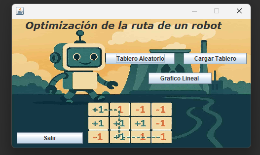
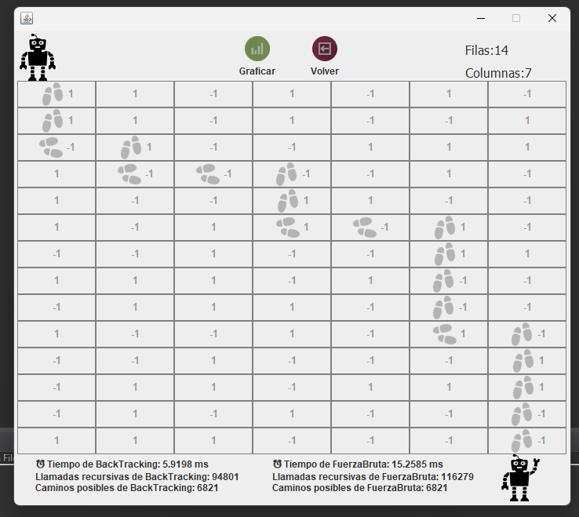
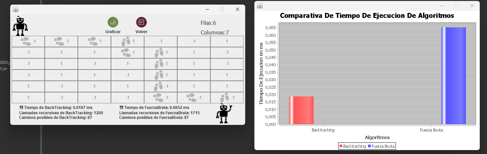

# 🤖 Robot Path Optimizer - Backtracking vs. Fuerza Bruta

### 🚀 Descripción
Este proyecto es un laboratorio de algoritmos diseñado para resolver problemas de optimización de rutas. El sistema calcula el camino más eficiente para un robot en un tablero de $N \times M$, comparando el rendimiento real entre algoritmos de **Backtracking** y **Fuerza Bruta**.

### 📊 Comparativa de Rendimiento
| Interfaz Principal | Simulación de Ruta | Gráfico de Ejecución |
| :---: | :---: | :---: |
|  |  |  |

### 🛠️ Stack Tecnológico
* **Lenguaje:** Java.
* **Algoritmos:** Backtracking vs. Fuerza Bruta.
* **Interfaz Gráfica:** Java Swing & JFreeChart (para los gráficos).
* **Análisis:** Comparación de tiempos de ejecución ($ms$) y cantidad de llamadas recursivas.

### 🧠 Conceptos Avanzados
* [cite_start]**Backtracking:** Implementación de poda para evitar ramas innecesarias en el árbol de decisión, reduciendo drásticamente el tiempo de procesamiento. [cite: 38]
* **Análisis de Complejidad:** El programa mide y muestra en tiempo real cuántas llamadas recursivas realiza cada algoritmo para llegar a la misma solución.
* **Visualización de Datos:** Generación dinámica de gráficos de barras para comparar la eficiencia de los algoritmos según el tamaño del tablero.

### 📂 Cómo ejecutarlo
1. **Clonar el repositorio:**
   git clone https://github.com/maxiluma18/tp-3-progra3
2. **Ejecución:**
   Abrir en un IDE y correr Menu.java.
3. **Prueba:**
   Podés generar tableros aleatorios o cargar configuraciones específicas para ver cómo el tiempo de Fuerza Bruta crece exponencialmente frente al Backtracking.

Proyecto desarrollado para la materia Programación 3 en la Universidad Nacional de General Sarmiento (UNGS).
